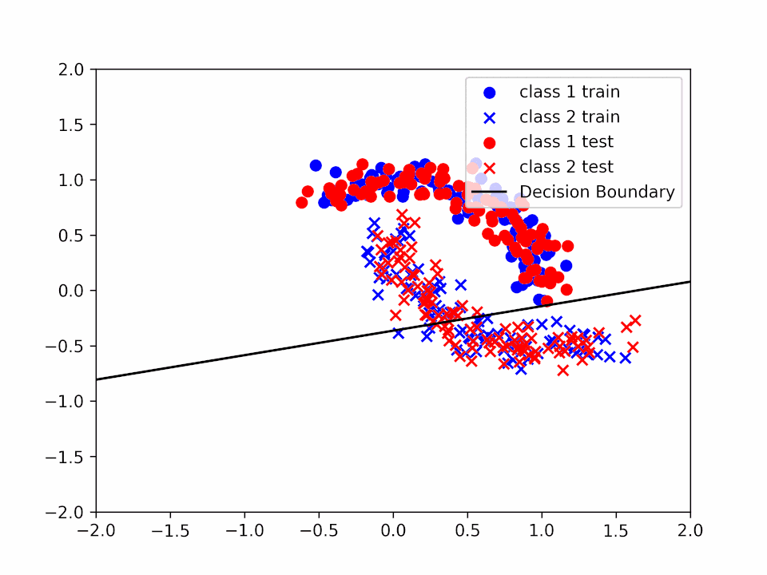

# WASP_AI_Course_Module2

This repo contains the code for project number 3 of the WASP_AI_Course_Module2 course assignment.

To execute the code you just need to run the following command:

```bash
python project3.py
```

The code will first generate the halfmoon datasets (Train and Validation), then will train the model with different ALPHA values and will save a gif with the evolution of the linear separator that the algorithm has learned.

In the folder images you will find the results of a previous execution of the code.
The format is training_alpha_{alpha}_{k}_3.gif (where k is the number of iterations of the entire dataset, alpha the learning rate, and the history of the weights is updated after 3 gradient descent, hence a single frame contains 3 gradient descent steps).

## Result and evaluation

We will start calculating the gradient of $F$ for the various components of $\theta$.

$$\frac{\partial}{\partial w_i} F = \frac{-y_i*x_i*e^{-y_i*(<w_i*x_i> + b)}}{1+e^{-y_i(<x_i,w>+b)}}$$

$$\frac{\partial}{\partial b} F = \frac{-y_i*e^{-y_i*(<w_i*x_i> + b)}}{1+e^{-y_i(<x_i,w>+b)}}$$

This has been used to calculate the gradient of the cost function and hence perform the gradient descent. This can be seen in the code in the `gradient_descent` function of the `project_3.py` file.

We have then test the algorithm varing 2 different values:

- ALPHA, with the following values: [0.01, 0.02, 0.05, 0.1, 0.2, 0.5, 1, 2, 5, 10]
- And number of iterations over the entire dataset, with the following values: [1,2,3]

Varing $\alpha$ we can see how "fast" the gradient descent has been performing.
We can see for instance in the following images how the decision boundary changes as we increase the value of alpha:

Decision Boundary for $\alpha = 0.01$


Decision Boundary for $\alpha = 0.2$


Decision Boundary for $\alpha = 1$


In the first case ($\alpha=0.01$) we can see that the decision boundary is not very accurate since we are not able to reach a minimum before the end of the training. In the second case ($\alpha=0.2$) we can see that the decision boundary is more accurate and that our $\theta$ is closer to a minimum. Finally, in the third case ($\alpha=1$) we can see that even if the decision boundary is quite accurate it "jumps" a lot, making very difficult to reach a precise value of $\theta$ that solves the minimization problem.

---

Considering instead the number of iteration of training over the entire dataset, as expected we can see that with the smaller alphas, it can require multiple iterations to reach a minimum. This instead becames neglegible compared to the larger $\alpha$ values, risking however a bigger overall error.

Over the same $\alpha$ values, we can see to reach a minimum we require multiple iterations along the entire dataset. However, this can became more problematic when we increase the number of iterations, since this can cause overfitting issues, however, this problem is less visible with a linear separator since is not "precise" enuogh to allow this kind of problem to become predominant.

Three iteration over the entire dataset for $\alpha = 0.2$:

Decision Boundary for $\alpha = 0.2$ and $k = 1$


Decision Boundary for $\alpha = 0.2$ and $k = 2$


Decision Boundary for $\alpha = 0.2$ and $k = 3$


We can see how the decision boundary become more and more accurate as we increase the number of iterations.

---

In conclusion, both the learning rate ($\alpha$) and the number of iterations over the entire dataset ($k$) can be used to improve the performance of the learning algorithm, however, it is important to tweak these values in the correct way to avoid jumps in performance or overfitting.
